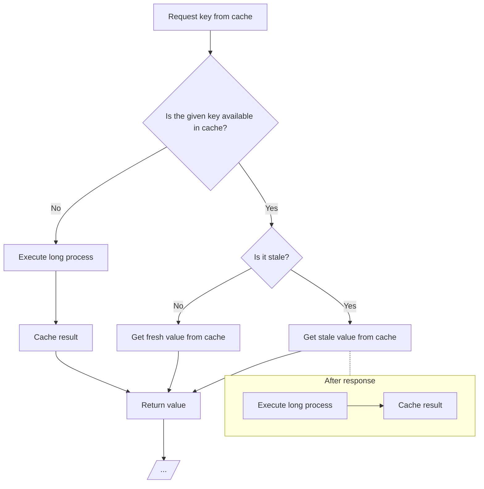

# Laravel Cache Stale-While-Revalidate

[](https://packagist.org/packages/iksaku/laravel-swr-cache)
[](https://github.com/iksaku/laravel-swr-cache/actions?query=workflow%3Arun-tests+branch%3Amain)
[](https://github.com/iksaku/laravel-swr-cache/actions?query=workflow%3A"Fix+PHP+code+style+issues"+branch%3Amain)
[](https://packagist.org/packages/iksaku/laravel-swr-cache)

There are applications out there that rely heavily on cache to improve performance,
and thanks to Laravel's `cache()->remember()` method, we can easily cache the result
of a callback for a given Time-To-Live (`TTL`).

However, there are cases when the callback may take a long time to execute, and
we don't want to wait for it to finish before giving a response back to the user.

This is where the [Stale-While-Revalidate](https://web.dev/stale-while-revalidate/)
pattern comes in handy. It allows us to return a cached result immediately, and
then execute the callback in the background to update the cache for the next
request.

<details>
<summary>How does SWR works under the hood?</summary>


</details>

## Installation

> [!IMPORTANT]
> This package makes use of [Atomic Locks](https://laravel.com/docs/11.x/cache#atomic-locks). Please make sure that your cache driver supports this feature.

You can install the package via composer:

```bash
composer require iksaku/laravel-swr-cache
```

## Usage

The `swr()` method is a wrapper around `cache()->remember()` that adds support for
the Stale-While-Revalidate pattern using a new Time-To-Stale argument (`TTS`).
You can access this method using the `cache()` helper function:

```php
$stats = cache()->swr(
    key: 'stats',
    ttl: now()->addHour(),
    tts: now()->addMinutes(15),
    callback: function () {
        // This may take a couple of seconds...
    }
);

// ...
```

Or using the `Cache` facade:

```php
$stats = \Illuminate\Support\Facades\Cache::swr(
    key: 'stats',
    ttl: now()->addHour(),
    tts: now()->addMinutes(15),
    callback: function () {
        // This may take a couple of seconds...
    }
);

// ...
```

Like the `remember()` method, if the value is not available in cache,
the callback will be executed and the result will be cached for the
given Time-To-Live and the corresponding Time-To-Stale will also be stored.

If the value is available and the Time-To-Stale has not passed,
the value is considered _fresh_ and will be returned immediately.
The callback will not be executed.

If the Time-To-Stale has passed, the value is considered _stale_,
it will be returned immediately, and the callback will be executed
after the response is sent to the user.

> [!TIP]
> [Mohamed Said](https://twitter.com/themsaid) has a great post on this.
> Check it out:
> [Running a task after the response is sent](https://divinglaravel.com/running-a-task-after-the-response-is-sent).

### Queueing the callback execution

If you prefer to queue the callback execution instead of running it after the
response is sent, you can use the `queue` argument:

```php
$stats = cache()->swr(
    key: 'stats',
    ttl: now()->addHour(),
    tts: now()->addMinutes(15),
    callback: function () {
        // This may take more than a couple of seconds...
    },
    queue: true
);
```

And, if you want to further customize the queued job, you can pass on a closure
that accepts a parameter of type [`Illuminate\Foundation\Bus\PendingClosureDispatch`](https://laravel.com/api/9.x/Illuminate/Foundation/Bus/PendingClosureDispatch.html):

```php
use Illuminate/Foundation/Bus/PendingClosureDispatch;

$stats = cache()->swr(
    key: 'stats',
    ttl: now()->addHour(),
    tts: now()->addMinutes(15),
    callback: function () {
        // This may take more than a couple of seconds...
    },
    queue: function (PendingClosureDispatch $job) {
        $job->onQueue('high-priority')
    }
);
```

## Testing

```bash
composer test
```

## Changelog

Please see [CHANGELOG](CHANGELOG.md) for more information on what has changed recently.

## Contributing

Please see [CONTRIBUTING](CONTRIBUTING.md) for details.

## Security Vulnerabilities

Please review [our security policy](../../security/policy) on how to report security vulnerabilities.

## Credits

- [Jorge González](https://github.com/iksaku)
- [All Contributors](../../contributors)

## License

The MIT License (MIT). Please see [License File](LICENSE.md) for more information.
