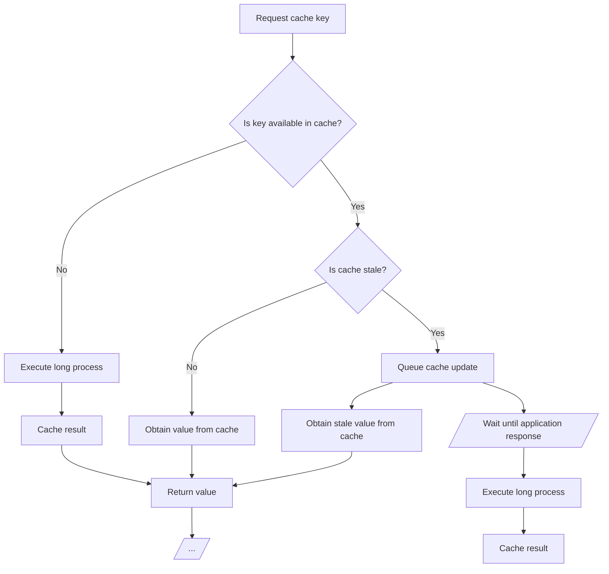

# This is my package laravel-swr-cache

[](https://packagist.org/packages/iksaku/laravel-swr-cache)
[](https://github.com/iksaku/laravel-swr-cache/actions?query=workflow%3Arun-tests+branch%3Amain)
[](https://github.com/iksaku/laravel-swr-cache/actions?query=workflow%3A"Fix+PHP+code+style+issues"+branch%3Amain)
[](https://packagist.org/packages/iksaku/laravel-swr-cache)

There are applications out there that rely heavily on cache to improve performance,
and thanks to Laravel's `cache()->remember()` method, we can easily cache the result
of a callback for a given time to live (TTL).

However, there are cases where the callback may take a long time to execute, and
we don't want to wait for it to finish before returning the result to the user.

This is where the [Stale-While-Revalidate](https://web.dev/stale-while-revalidate/)
pattern comes in handy. It allows us to return a cached result immediately, and
then execute the callback in the background to update the cache for the next
request.

<details>
<summary>How SWR works under the hood?</summary>


</details>

## Installation

You can install the package via composer:

```bash
composer require iksaku/laravel-swr-cache
```

## Usage

The `swr()` method is a wrapper around `cache()->remember()` that adds support for
the Stale-While-Revalidate pattern.
You can access it using the `cache()` helper:

```php
$stats = cache()->swr(
    key: 'stats',
    ttl: now()->addHour(),
    tts: now()->addMinutes(15),
    callback: function () {
        // This may take a couple of seconds...
    }
);

// ...
```

Or using the `Cache` facade:

```php
$stats = \Illuminate\Support\Facades\Cache::swr(
    key: 'stats',
    ttl: now()->addHour(),
    tts: now()->addMinutes(15),
    callback: function () {
        // This may take a couple of seconds...
    }
);

// ...
```

If the value is available in cache, it will be returned immediately,
otherwise, the callback will be executed and the result will be cached.

If the value is stale, the value from cache will be returned immediately,
and the callback will be executed after the response is sent to the user.
You can learn more about this strategy on the
[Running a task after the response is sent](https://divinglaravel.com/running-a-task-after-the-response-is-sent)
post from [Mohamed Said](https://twitter.com/themsaid).

### Queueing the callback execution

If you prefer to queue the callback execution instead of running it after the
response is sent, you can use the `queue` parameter:

```php
$stats = cache()->swr(
    key: 'stats',
    ttl: now()->addHour(),
    tts: now()->addMinutes(15),
    callback: function () {
        // This may take more than a couple of seconds...
    },
    queue: true
);
```

And, if you want to further customize the queued job, you can pass on a closure
that accepts a parameter of type [`Illuminate/Foundation/Bus/PendingClosureDispatch`](https://laravel.com/api/9.x/Illuminate/Foundation/Bus/PendingClosureDispatch.html):

```php
use Illuminate/Foundation/Bus/PendingClosureDispatch;

$stats = cache()->swr(
    key: 'stats',
    ttl: now()->addHour(),
    tts: now()->addMinutes(15),
    callback: function () {
        // This may take more than a couple of seconds...
    },
    queue: function (PendingClosureDispatch $job) {
        $job->onQueue('high-priority')
    }
);
```

## Testing

```bash
composer test
```

## Changelog

Please see [CHANGELOG](CHANGELOG.md) for more information on what has changed recently.

## Contributing

Please see [CONTRIBUTING](CONTRIBUTING.md) for details.

## Security Vulnerabilities

Please review [our security policy](../../security/policy) on how to report security vulnerabilities.

## Credits

- [Jorge González](https://github.com/iksaku)
- [All Contributors](../../contributors)

## License

The MIT License (MIT). Please see [License File](LICENSE.md) for more information.
